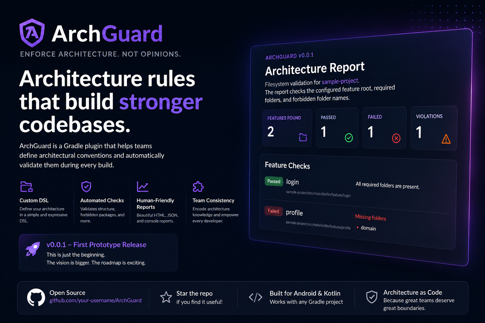

<div align="center">



# 🛡️ ArchGuard

### Enforce Architecture. Not Opinions.

**A Gradle plugin that lets senior engineers define architectural rules and automatically validates every build.**

[]()
[]()
[]()

</div>

---

## Why ArchGuard?

Every engineering team has architecture guidelines.

But those guidelines usually live in:

- Documentation
- Wiki pages
- Pull request comments
- Senior engineers' heads

Eventually someone accidentally breaks the architecture.

Not because they're careless.

Because **architecture isn't executable.**

ArchGuard changes that.

Instead of saying:

> "Presentation should never depend on Data."

You define it once.

Then every build enforces it automatically.

---

# Features

✅ Gradle Plugin

✅ Custom Architecture DSL

✅ Configurable Package Structure Rules

✅ Console Reports

✅ JSON Reports

✅ Team-wide Architecture Validation

---

# Example

Instead of documenting your architecture...

```text
feature

    login

        presentation

        domain

        data
```

Make it executable.

```kotlin
archGuard {

    reports {
        html {
            enabled = true
            outputPath = "archguard-report.html"
        }
    }

    architecture {

        featureRoot = "feature"

        layer("presentation") {
            required = true
        }

        layer("domain") {
            required = true
        }

        layer("data") {
            required = true
        }

        forbid(
            "helper",
            "util",
            "manager"
        )
    }

}
```

Now simply run

```bash
./gradlew architectureCheck
```

Output

```text
==================================
ArchGuard
==================================

Loading Architecture...

✓ login

✗ profile

Missing required layer

domain

----------------------------------

Summary

Features Checked : 2

Passed : 1

Failed : 1

Violations : 1
```

---

# Philosophy

ArchGuard does **not** tell you how to architect your project.

Instead...

**You define the architecture.**

ArchGuard enforces it.

That means it works with

- Clean Architecture
- Modular Architecture
- Feature-first Architecture
- Layer-first Architecture
- DDD
- Your own conventions

---

# Current Capabilities

Version **0.1**

- Package structure validation
- Configurable architecture DSL
- Forbidden package detection
- JSON reports
- Console reports

---

# Planned Features

- Layer dependency validation
- Import analysis
- Circular dependency detection
- Architecture score
- HTML reports
- Dependency graph visualization
- GitHub Action
- IntelliJ Plugin
- SARIF support

---

# Project Structure

```
ArchGuard

├── archguard-core
│
├── archguard-gradle-plugin
│
└── sample-project
```

---

# Motivation

Senior engineers spend years learning architecture.

Junior engineers join the team with little context.

ArchGuard allows teams to encode architectural decisions into executable rules.

Instead of learning only from code reviews...

Developers receive immediate feedback during the build.

---

# Roadmap

## v0.1

✅ Package validation

✅ Gradle DSL

✅ JSON reports

---

## v0.2

- Package declaration validation
- Dependency rules

---

## v0.3

- Import analysis
- Layer dependency validation

---

## v0.4

- HTML reports
- Architecture score

---

## v1.0

- Stable Rule Engine
- IntelliJ Plugin
- GitHub Action

---

# Why not Detekt?

Detekt focuses primarily on code quality and static analysis rules.

ArchGuard focuses on **architectural integrity**.

Examples:

- Does every feature contain the required layers?
- Does the project follow the team's architectural conventions?
- Are forbidden package structures introduced?
- (Future) Are layer dependencies respected?

The two tools complement each other rather than compete.

---

# Contributing

Contributions are welcome.

If you'd like to improve ArchGuard:

1. Fork the repository.
2. Create a feature branch.
3. Open a pull request.

Please include tests for new functionality.

---

# License

MIT License

---

<div align="center">

### ⭐ If ArchGuard helps your team, consider giving the repository a star.

Architecture should be executable.

Not just documented.

</div>